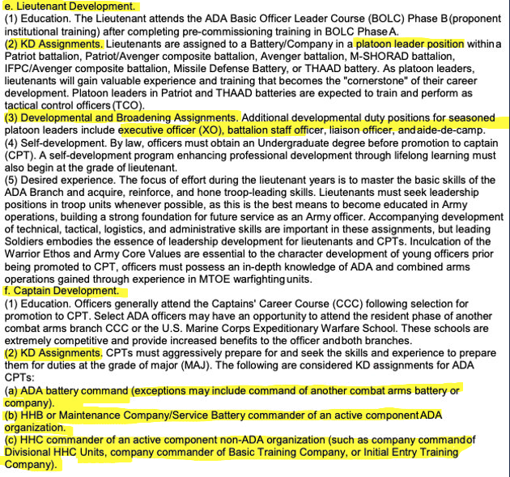
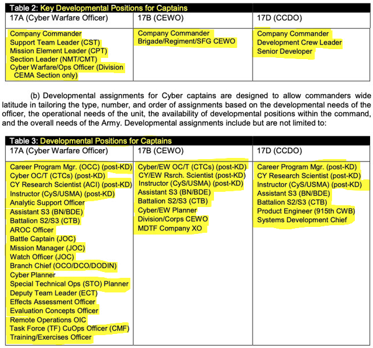
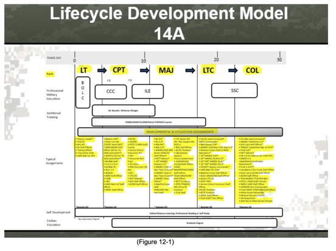

 

  
<h1> Part I: Data Overview </h1>

Our data source was documents from the *Smartbook for DA Pam 600-3 Officer Professional Development and Career Management*. These documents spanned 11 Army Operations branches and 3 Information Dominance branches. In these documents, the desired attributes were presented in one of three ways: text form, a tabular layout, or with a flowchart. Below are examples of each type of presentation with the desired information for our analysis highlighted. The formatting inconsistencies was 

*PAM DA 600-3: Information in Text Format*
{width=90%} 

*PAM DA 600-3: Information in Tabular Format*
{width=90%}

*PAM DA 600-3: Information in Flowchart*
{width=60%}

