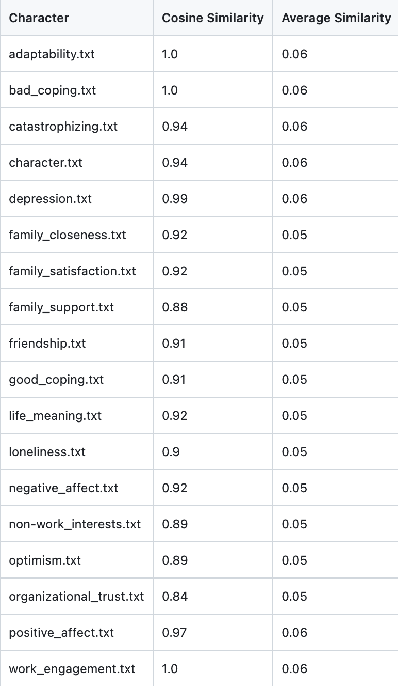
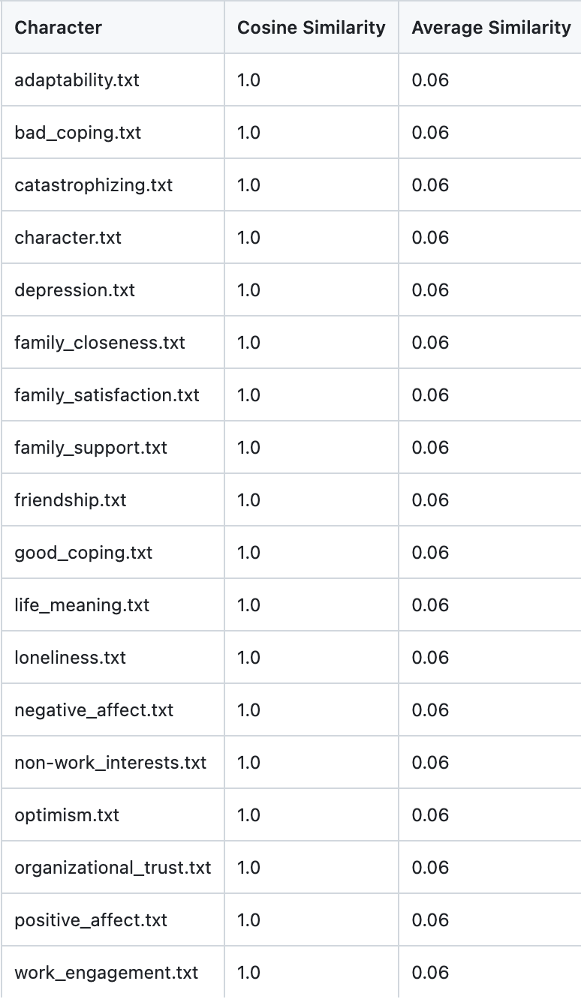
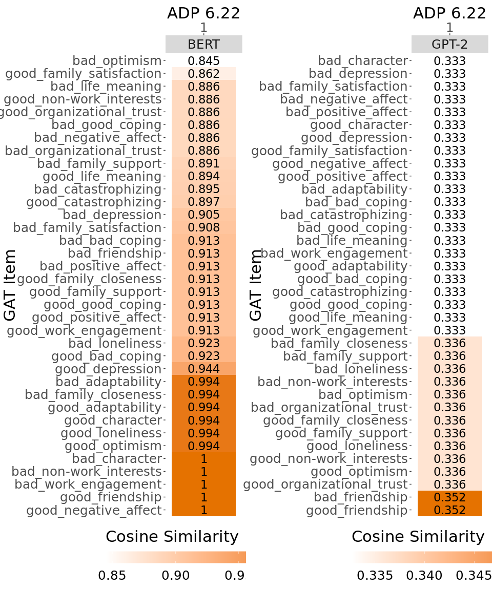
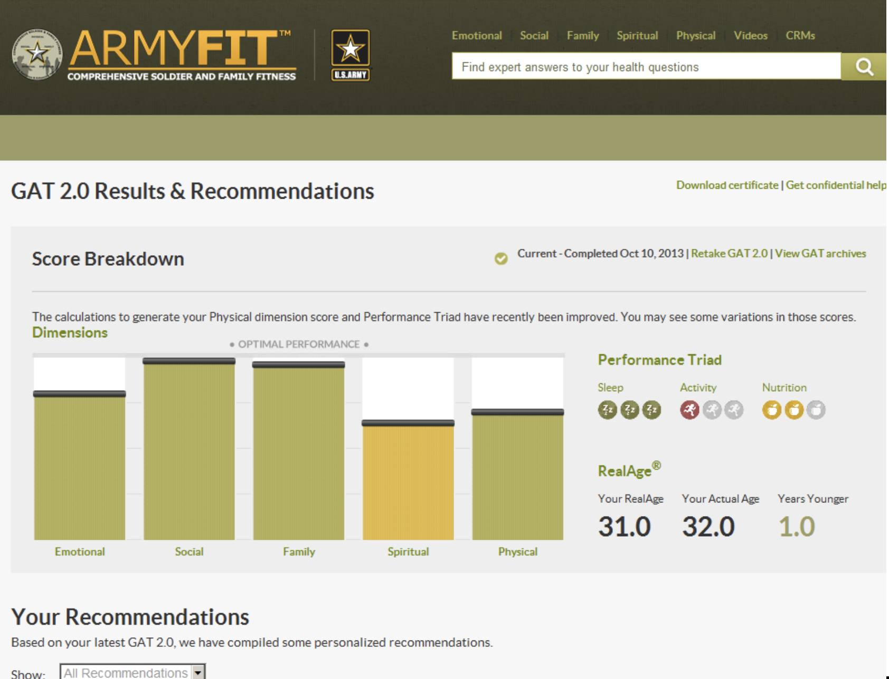

Army Doctrine Publication serves as the baseline document. 

{width=90%}
*Similarity Analysis using BERT*

{width=90%} 
*Similarity Analysis using GPT*

{width=80%}
Similarity of GAT doc to ADP

 
 

The results of the above survey is analyzed to determine the resilience in the five dimensions of
strength, as well as your RealAge. Feedback on the three elements of the Performance Triad - Sleep, Activity, and Nutrition is also provided. This helps to determine the strengths and the areas to improve.   

Below image describes a sample result of the the GAT survey.

{width=100%}
*Survey Analysis*

 
 

