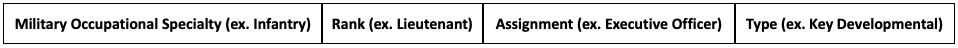

 
 

The goal of the first part of the project was to use Army documents to create a dataset of officer assignments that could assist the team on the Army Research Institute project in modeling soldier career progression. For our purposes, "assigments" are jobs, or positions, a soldier can hold in their branch of the Army. Each assignment is correlated with a rank, such as "Captain" or "Colonel." Assignments are also categorized as either "Key Developmental" or "Developmental/Broadening." "Key developmental" assignments are important assignments for an officer to complete in order to advance in rank, while "developmental" or "broadening" assignments are also work positions but do not contribute to a soldier's advancement. A sample instance of the desired output from this portion of the project might look something like this:

 

*Desired Ouput Format of Data From Army Documents*

 

To accomplish our goal of creating such a simple dataset, we had to explore a variety of methods for extracting data from a corpus of documents with inconsistent information presentation and formatting. Learn more about these documents by viewing our <a href=Data_Pt1.html>data source</a> page. 