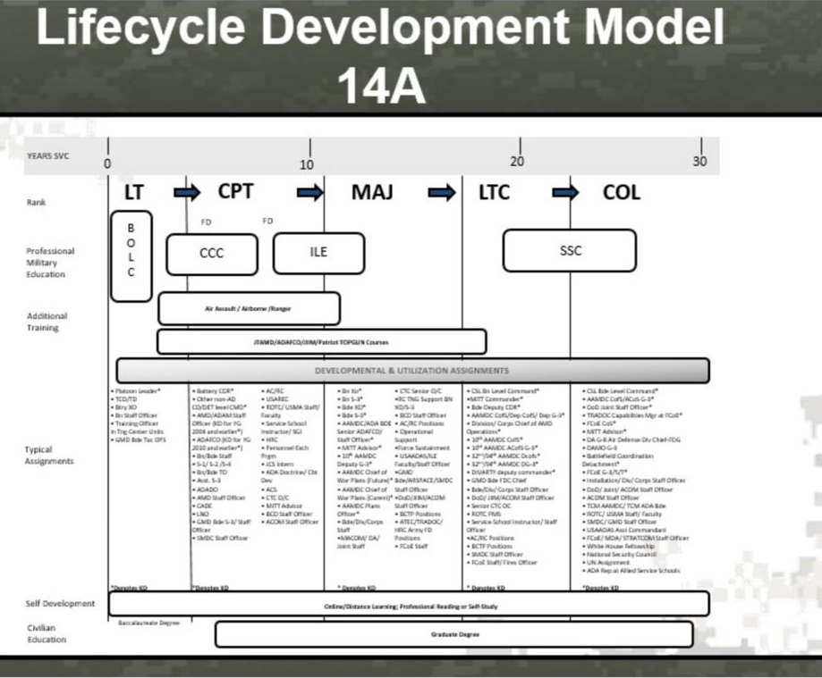

 
 

  
<h2> Method I: Image Upscaling  </h2>

We initally looked to the flowcharts in the PAM-DA-300 documents as a convenient source for our desired attributes. However, the charts were inserted into the document with an image format of low quality. So, we attempted to use image upscaling to make the information more readably by technology. However, image upscaling only increased the clarity of characters in large or bold font, and instead made the smaller-type assignments we were targeting less legible. "Before" and "after" images of a career progression chart that underwent upscaling are shown below:

*Original Image*
 
 

*Upscaled Image*
 

 
