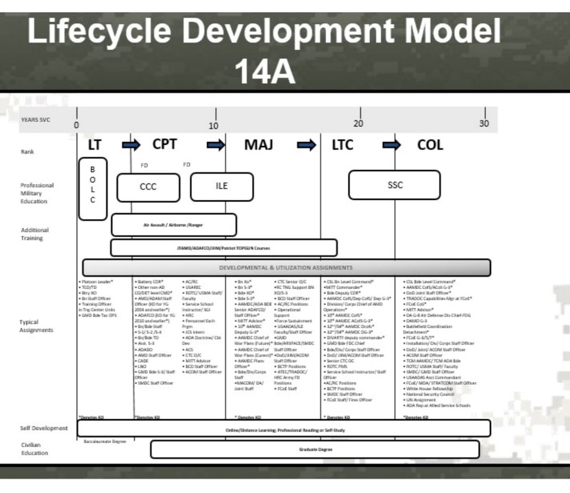
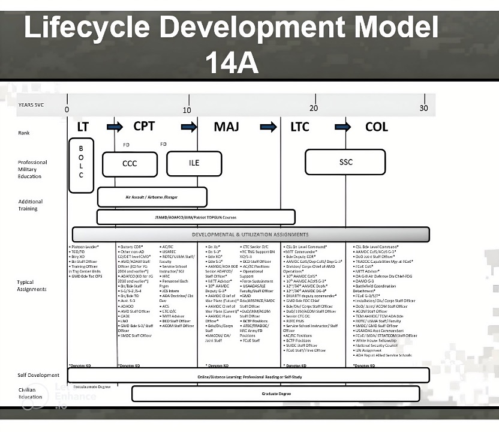
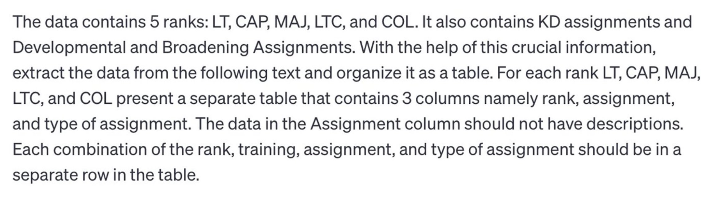
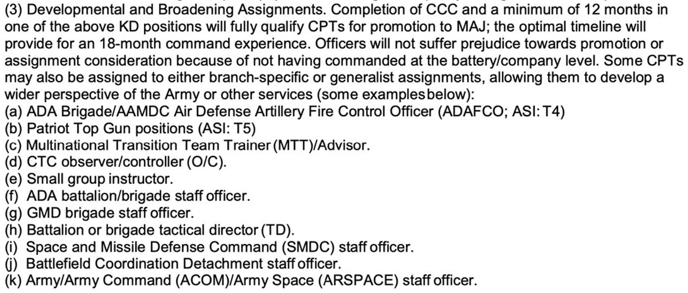

Throughout the duration of this project, we have thoroughly examined a range of text extraction techniques. Moreover, we have provided comprehensive assessments of the advantages and disadvantages associated with each technique. By documenting these findings, we aim to facilitate future studies, enabling them to leverage the knowledge gained from our research. The advantages and disadvantages of each method can be assessed with the requirements of the project to enable the selection of the most suitable approach.  

# Method 1. Image Upscaling

Since the document contained an image encompassing ranks, assignments, and their types, we deemed it advantageous to extract the data from the image. However, the image itself was of notably low quality. Consequently, our initial approach involved upscaling the image to enhance its resolution. We experimented with various combinations, including 200x and 400x upscaling. While these methods did improve the image quality to some extent, the extracted assignments remained difficult to read and comprehend. Therefore, we transitioned to employing text extraction techniques using ChatGPT to overcome this challenge. 

{width=60%}
{width=60%}

  
<h2>**Advantages**</h2>

  
Image upscaling offers several advantages, including improved resolution, reduced noise, and time efficiency. By enhancing the resolution of images, upscaling techniques contribute to a clearer and more detailed visual representation. Additionally, the reduction of noise artifacts in the upscaled images enhances their overall quality, while the time efficiency of the upscaling process allows for faster and more streamlined image enhancement workflows. 

    

  
<h2>**Disadvantages**</h2>

  
Image upscaling techniques can present drawbacks including the potential for distorted results, illegible output, and only partial improvement in image quality. These limitations can arise due to the inherent challenges in extrapolating information to a higher resolution. Furthermore, while some improvement in quality can be achieved, the upscaling process may not fully address all the nuances and details of the original image. 

# Method 2. Chat-GPT

The methodology employed for text extraction using ChatGPT involved providing a prompt along with the relevant section of the document containing the assignments. Multiple prompts were tested and experimented with, ultimately selecting the prompt that yielded the most accurate results. However, a challenge arose as slight rearrangements of the words in the prompt led to different outputs from GPT. Furthermore, another obstacle emerged when attempting to extract data for "Lieutenant Colonel" and "Colonel" assignments, as GPT failed to retrieve the desired information. Due to these limitations and inaccuracies in the results, the decision was made to transition to a Regex-based approach. 

{width=60%}

  
<h2>**Advantages**</h2>

  
It offers several advantages, including its ease and speed of implementation, the ability to reuse prompts for consistent results, and its effectiveness in extracting data across various test documents. This makes ChatGPT a convenient and efficient tool for text extraction tasks, ensuring consistent and reliable outcomes regardless of the document being analyzed. 

    

  
<h2>**Disadvantages**</h2>

  
It does have certain limitations, such as being sensitive to user input, potentially generating varying outputs for identical prompts, and exhibiting less precision in extracting assignments. These drawbacks highlight the need for careful and specific input formulation to achieve desired results, while acknowledging the inherent challenges of maintaining consistency and precision in the extraction process. 

# Method 3. Regex

The final method we explored to extract data from the Army documents was the use of regular expressions, which match strings of interest in the text. Unlike the ChatGPT method, writing regular expressions took more time on the part of the scientist. Since each branch used a unique formatting style, our regular expressions had to be modified for each document. A basic function using regular expressions would iterate through each character in the document and match to the sections following bullet points.  

While this highly supervised extraction method was more time-intensive, it also allowed for the most precise extraction of assignments of the three methods explored and allowed for better control of the output format. 

We chose the regular expression technique as the final method to extract data from documents. This method was the best fit for our set of data because we had a small number of documents (14), and favored reproducible results that captured the most individual assignments and their types over the more variable outputs produced by ChatGPT. We noted that if our dataset was much larger, this method would not be ideal because of how time intensive it was to make edits to the code for each document we needed to analyze. However, this method was satisfactory for completing our goals during this phase of the project.  

{width=60%}

``
myfunction <- function(input){
  vector <- unlist(str_split(input, pattern = "\\h\\(.\\)\\h"))
  return(vector)
}
``
